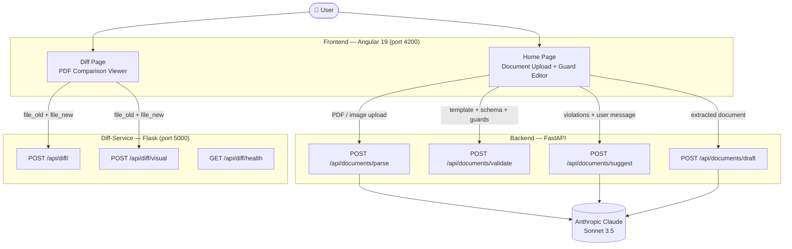
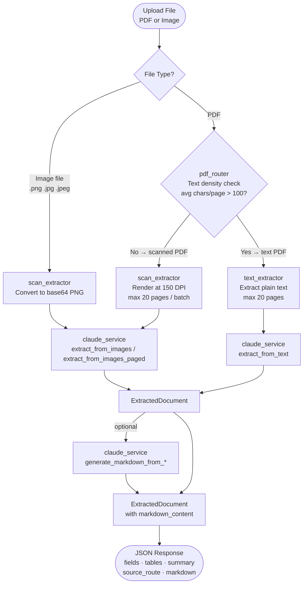
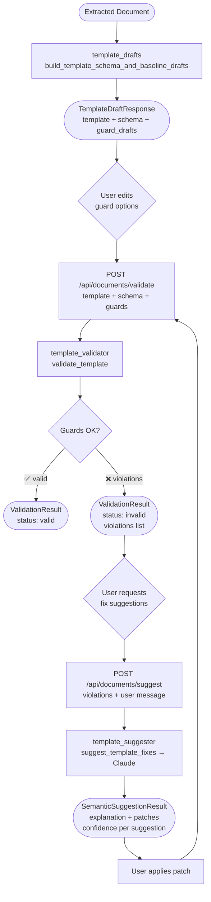
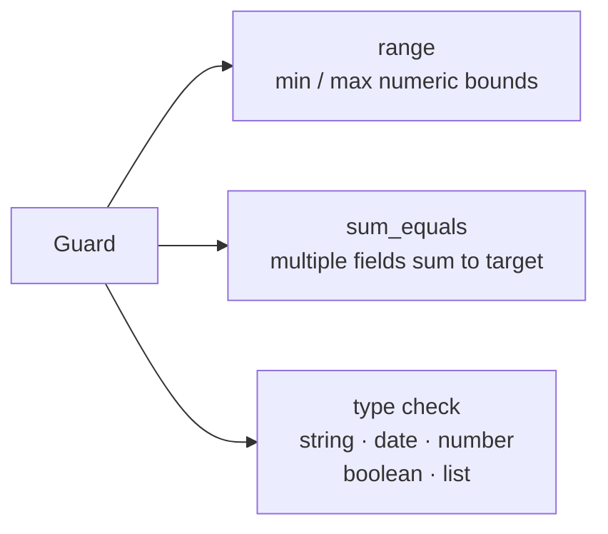
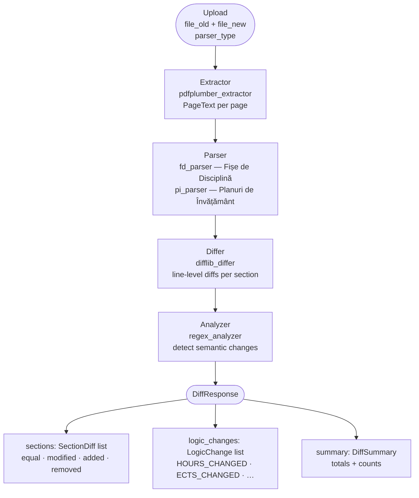
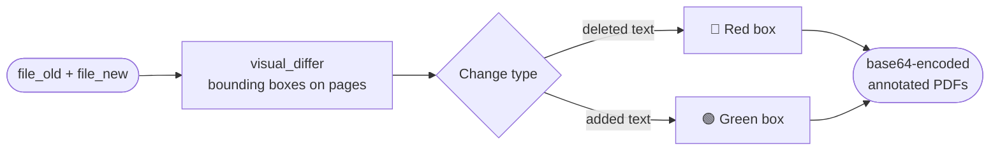
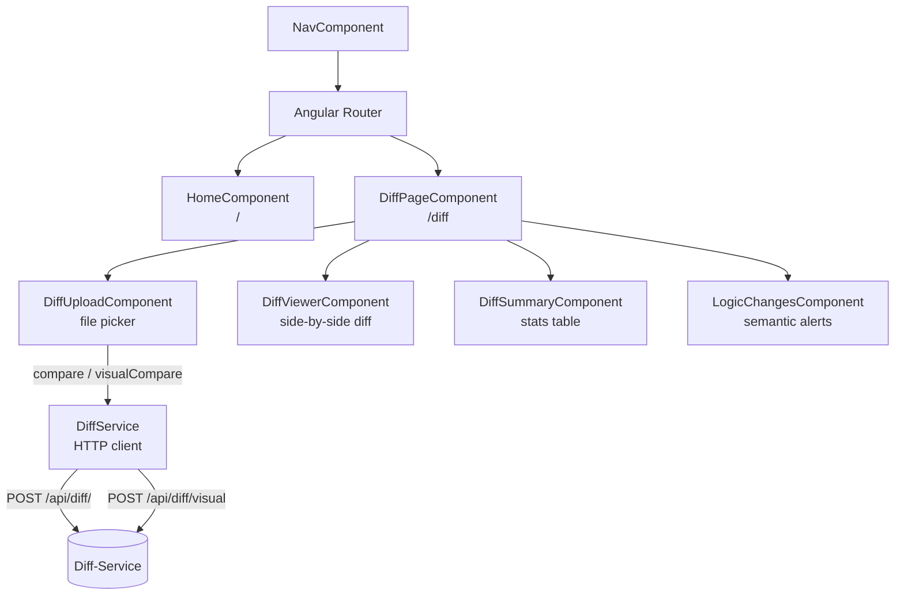
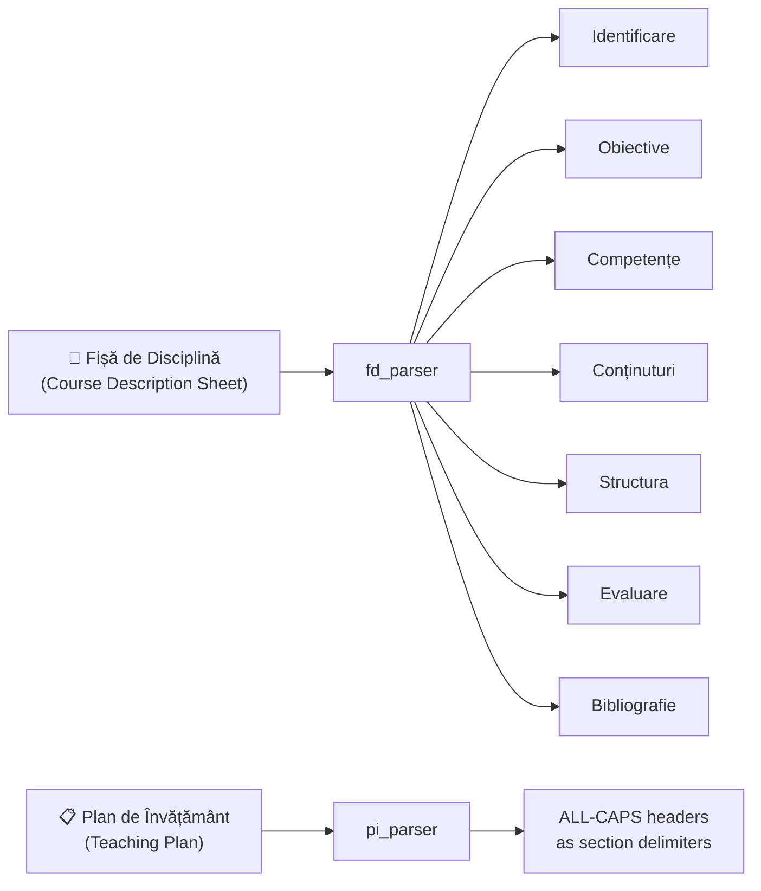

# System Architecture & Data Flow

> **Teacher Paperwork Assistant** — processes, validates, and compares Romanian academic documents.

## High-Level Architecture

---

## Document Extraction Flow (`/api/documents/parse`)

---

## Template Validation & Suggestion Flow

### Guard Types

---

## Diff-Service Processing Pipeline (`/api/diff/`)

### Visual Diff Flow (`/api/diff/visual`)

---

## Frontend Component Structure

---

## Parser Target Documents

